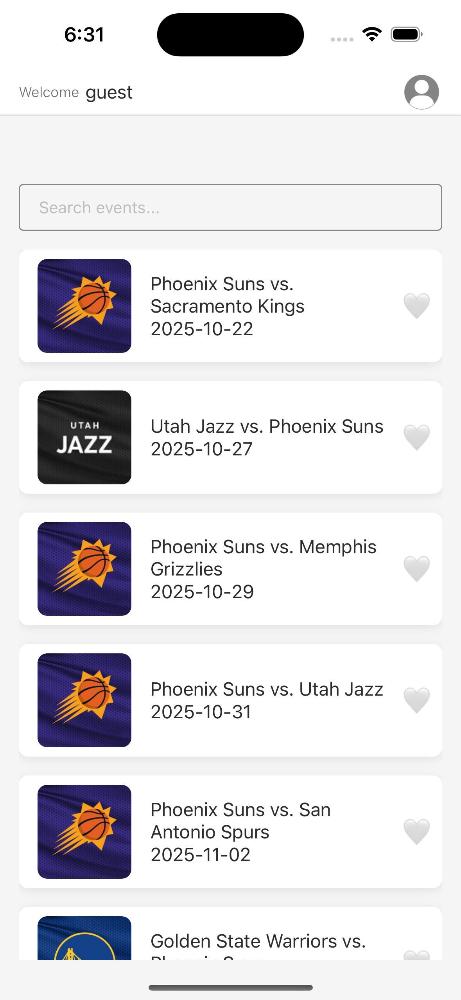
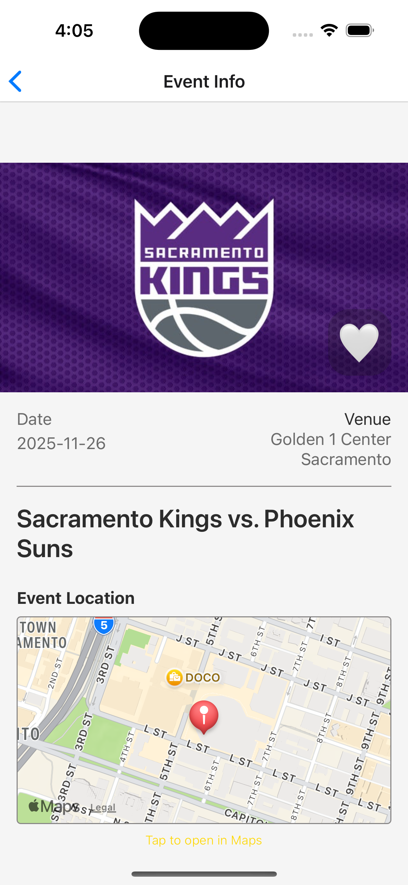
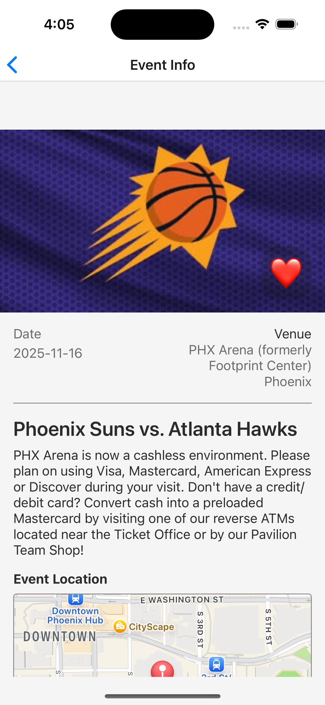

# CityPulse

CityPulse is a mobile application designed to help users discover and engage with events happening around them. It provides a seamless experience for browsing, searching, and saving favorite events, with options for both registered users and guests.

---

## ✨ Features

- **User Authentication**: Users can register for a new account or log in with existing credentials.
- **Guest Mode**: Explore events without needing to create an account.
- **Multi-lingual Support**: Fully localized experience with support for **English** and **Arabic**.
- **Map View**: Displays an event location on an interactive map with a marker. Tapping the marker opens the location in the device's default Maps app (Google Maps / Apple Maps).
- **Event Discovery**:
- Browse a paginated list of upcoming events on the Home screen.
- Search for specific events by city or name.
- Pull to refresh data
- **Personalized Experience**:
- Logged-in users can mark and unmark events as favorites.
- The app saves favorited events to each user's profile, ensuring that preferences remain private and are not visible to other users.
- **Detailed Event Information**: View full description, date, and venue of events.
- **Profile Management**:
- View user information.
- Log out to switch accounts.
- Delete account option for registered users.

---

🚀 Getting Started

To get a local copy up and running, follow these simple steps.

Installation
```
Clone the repository: git clone https://github.com/your-username/citypulse.git

Navigate to the project directory: cd CityPulse

Install the dependencies: npm install

Run:npx expo run:ios
```

📂 Project Structure
The project is organized into logical folders for easy navigation:
```
citypulse/
├── src/
│   ├── components/      # Reusable UI components (buttons, cards, inputs)
│   ├── context/         # Global state management using React Context
│   ├── hooks/           # Custom React hooks (useForm, useApi, useStorage, etc.)
│   ├── localization/    # Localization files (en.ts, ar.ts)
│   ├── navigation/      # React Navigation setup and navigation stacks
│   ├── screens/         # Main screens (Home, Login, Profile, etc.)
│   ├── services/        # API and other service layers
│   ├── theme/           # Styling, color schemes, and design constants
│   ├── types/           # TypeScript type definitions and interfaces
│   ├── App.tsx          # Main application entry point
├── README.md            # Project documentation
```

## 📱 Screenshots

### Login Screen
<p float="left">
  
  
  
  
</p>

### Signup Screen
<p float="left">
  
  
  
  
</p>

### Home Screen
<p float="left">
  
  
  
</p>

### Event Details Screen
<p float="left">
  
  
  
  
  
</p>

### Profile Screen
<p float="left">
  
  
  
  
  
</p>


